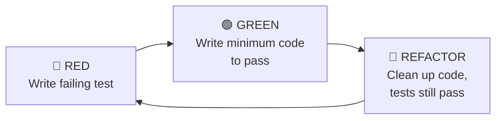
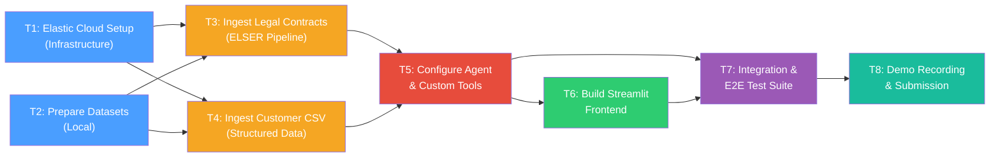

# Implementation Plan: Governance Guardian

## Summary

**Governance Guardian** is an AI compliance agent built on the **Elastic Agent Builder** platform for the Elastic Hackathon (deadline: Feb 27, 2026). It automates "Level 1" compliance checks by combining **semantic search** (ELSER-powered vector retrieval over legal contracts) with **structured ES|QL queries** (data inspection for PII/risk) to render grounded, citation-backed verdicts.

This plan covers every deliverable end-to-end: Elastic Cloud provisioning, data ingestion (legal contracts + synthetic customer CSV), agent configuration with two custom tools, a Streamlit chat UI, demo recording, and submission packaging.

**All implementation follows strict TDD (Test-Driven Development).** Every task starts by writing failing tests, then implementing the minimum code to pass them, then refactoring. Integration and automated E2E tests are first-class deliverables, not afterthoughts.

---

## Approach & Alternatives Considered

| Strategy | Pros | Cons | Verdict |
|---|---|---|---|
| **A. Kibana-native Agent Chat** | Zero frontend code; built-in | Limited customization; no branded look for demo video | ❌ Rejected |
| **B. Streamlit + Elastic Agent API** | Custom UI, fast to build in Python, great for demos | Extra component to maintain | ✅ **Chosen** |
| **C. Next.js / React frontend** | Most flexible | Overkill for a hackathon with a 3-min demo | ❌ Rejected |

**Rationale:** Streamlit gives us a polished, branded chat interface with minimal code (~150 LOC) while keeping the backend entirely on Elastic. The Agent Builder REST API handles all LLM + tool orchestration. Kibana remains available as a fallback / debugging surface.

---

## TDD Methodology

Every task in this plan follows the **Red → Green → Refactor** cycle:



| Principle | How We Apply It |
|---|---|
| **Tests first** | For every script/module, write `test_*.py` *before* the implementation file |
| **Smallest increment** | Each test covers one specific behavior; implement just enough to pass |
| **Integration tests** | After unit tests pass, write integration tests that hit the real Elastic cluster |
| **E2E tests** | Automated tests that exercise the full pipeline: data → Elastic → Agent → response |
| **Test runner** | `pytest` with `pytest-cov` for coverage; all tests runnable via `pytest tests/` |
| **CI-ready** | Tests categorized with markers: `@pytest.mark.unit`, `@pytest.mark.integration`, `@pytest.mark.e2e` |

---

## Execution Order Diagram



> [!NOTE]
> **T1** and **T2** can run in parallel (infrastructure setup while curating data locally). **T3** and **T4** can also run in parallel once both T1 and T2 are complete. Unit tests are written *within* each task (TDD). **T7** aggregates the cross-cutting integration and e2e tests that span multiple components.

---

## Task Breakdown

### T1: Elastic Cloud Infrastructure Setup
**Risk:** Low · **Depends on:** None

| Item | Detail |
|---|---|
| **Goal** | Provision a working Elastic Cloud deployment with ML nodes for ELSER |
| **Steps** | 1. Create an Elastic Cloud Serverless project (or start a Cloud Trial) <br/> 2. Enable autoscaling for ML nodes (min 4 GB) <br/> 3. Deploy ELSER v2 model via **Machine Learning → Trained Models** <br/> 4. Verify ELSER status is `started` via `GET _ml/trained_models/.elser_model_2/stats` <br/> 5. Record Cloud ID, API key, and Elasticsearch endpoint in `.env` |
| **Files** | `[NEW] .env.example` — template with placeholder env vars <br/> `[NEW] .gitignore` — exclude `.env`, `__pycache__`, `.streamlit/secrets.toml` <br/> `[NEW] conftest.py` — shared pytest fixtures (ES client, env loading) <br/> `[NEW] pytest.ini` — markers for `unit`, `integration`, `e2e` |

#### TDD for T1

| Phase | Action |
|---|---|
| 🔴 **RED** | Write `tests/test_infra.py` with a test `test_elasticsearch_connection()` that asserts a successful ping to the ES endpoint, and `test_elser_model_deployed()` that asserts ELSER v2 status is `started` |
| 🟢 **GREEN** | Complete the Elastic Cloud setup until both tests pass |
| 🔵 **REFACTOR** | Extract ES client creation into a reusable `conftest.py` fixture |

| **Acceptance** | `pytest tests/test_infra.py -m integration` passes (2/2 tests green) |

---

### T2: Prepare Datasets Locally
**Risk:** Low · **Depends on:** None (parallel with T1)

#### T2a: Legal Contracts (CUAD subset)

| Item | Detail |
|---|---|
| **Source** | [CUAD v1 on Zenodo](https://zenodo.org/record/4595826) — 510 commercial contracts (PDF) |
| **Action** | 1. Download the full dataset <br/> 2. Hand-pick **5–10 contracts** with privacy-relevant clauses (NDA, Data Privacy, Non-Disclosure) <br/> 3. Place them in `data/contracts/` |
| **Files** | `[NEW] data/contracts/*.pdf` (5–10 curated PDFs) <br/> `[NEW] data/README.md` — provenance notes, license (CC BY 4.0) |

#### T2b: Synthetic Customer Data

| Item | Detail |
|---|---|
| **Source** | Generate with Python `Faker` library (preferred over Kaggle for precise control of columns) |
| **Action** | 1. Write a script to generate ~1,000 rows: `Name`, `Email`, `Age` (some < 18), `Country` (some in "GDPR_Restricted_Zone"), `Subscription_Type` <br/> 2. Output: `data/customers.csv` |
| **Files** | `[NEW] scripts/generate_customers.py` <br/> `[NEW] data/customers.csv` |

> [!TIP]
> Using Faker gives us deterministic, repeatable data with guaranteed edge cases (minors, restricted regions) baked in. This is better than hunting for a perfect Kaggle CSV.

#### TDD for T2b

| Phase | Action |
|---|---|
| 🔴 **RED** | Write `tests/unit/test_generate_customers.py`: <br/> • `test_csv_has_correct_columns()` — asserts columns are `Name, Email, Age, Country, Subscription_Type` <br/> • `test_csv_has_expected_row_count()` — asserts ~1,000 rows <br/> • `test_csv_contains_minors()` — asserts at least one row where `Age < 18` <br/> • `test_csv_contains_restricted_regions()` — asserts at least one row where `Country == "GDPR_Restricted_Zone"` <br/> • `test_csv_emails_are_unique()` — asserts no duplicate emails <br/> • `test_csv_is_deterministic()` — asserts two runs with same seed produce identical output |
| 🟢 **GREEN** | Implement `scripts/generate_customers.py` until all 6 tests pass |
| 🔵 **REFACTOR** | Extract config (row count, seed, ratio of minors/restricted) into constants at the top of the script |

| **Acceptance** | `pytest tests/unit/test_generate_customers.py -m unit` passes (6/6 tests green) |

---

### T3: Ingest Legal Contracts into Elasticsearch (ELSER Pipeline)
**Risk:** Medium · **Depends on:** T1, T2a

| Item | Detail |
|---|---|
| **Goal** | Create index `legal-knowledge-base` with ELSER-enriched chunks |
| **Steps** | 1. **Create ingest pipeline** `legal-elser-pipeline`: <br/> &nbsp;&nbsp;• `attachment` processor (Base64 PDF → text) <br/> &nbsp;&nbsp;• `script` processor (paragraph-level chunking) <br/> &nbsp;&nbsp;• `inference` processor (ELSER v2 for sparse vector) <br/> 2. **Create index mapping** for `legal-knowledge-base`: <br/> &nbsp;&nbsp;• `content` → `text` <br/> &nbsp;&nbsp;• `content_embedding` → `sparse_vector` <br/> &nbsp;&nbsp;• `source_file` → `keyword` <br/> &nbsp;&nbsp;• `chunk_id` → `integer` <br/> 3. **Ingest PDFs** using a Python script or Kibana Data Visualizer <br/> 4. **Verify** with a test sparse vector query |
| **Files** | `[NEW] scripts/ingest_contracts.py` — bulk-indexes chunked contract text <br/> `[NEW] elastic/legal-knowledge-base-mapping.json` <br/> `[NEW] elastic/legal-elser-pipeline.json` |

> [!IMPORTANT]
> **Alternative path:** If programmatic PDF ingestion via the attachment processor proves brittle, fall back to the **Kibana Data Visualizer** upload (ML > Data Visualizer > Import), which natively handles PDF → text → ELSER. Document whichever path actually works in the repo README.

#### TDD for T3

| Phase | Action |
|---|---|
| 🔴 **RED** | Write `tests/unit/test_ingest_contracts.py`: <br/> • `test_pdf_to_text_extraction()` — asserts text is extracted from a sample PDF <br/> • `test_paragraph_chunking()` — asserts text is split into paragraph-level chunks <br/> • `test_chunk_metadata()` — asserts each chunk has `source_file` and `chunk_id` fields |
| 🟢 **GREEN** | Implement chunking and text extraction logic in `scripts/ingest_contracts.py` |
| 🔵 **REFACTOR** | Extract the chunking logic into a reusable module `scripts/chunker.py` |
| 🔴 **RED** (integration) | Write `tests/integration/test_contract_ingestion.py`: <br/> • `test_pipeline_exists()` — asserts the `legal-elser-pipeline` is registered in ES <br/> • `test_index_mapping_correct()` — asserts the index mapping has `sparse_vector` field <br/> • `test_documents_indexed()` — asserts `legal-knowledge-base/_count > 0` <br/> • `test_semantic_search_returns_results()` — asserts a text_expansion query for "data privacy" returns >0 hits with `source_file` field populated |
| 🟢 **GREEN** | Run ingestion script, verify integration tests pass |

| **Acceptance** | `pytest tests/unit/test_ingest_contracts.py -m unit` (3 green) AND `pytest tests/integration/test_contract_ingestion.py -m integration` (4 green) |

---

### T4: Ingest Customer CSV into Elasticsearch
**Risk:** Low · **Depends on:** T1, T2b

| Item | Detail |
|---|---|
| **Goal** | Create index `customer_leads_prod` with proper field mappings |
| **Steps** | 1. **Create index mapping**: <br/> &nbsp;&nbsp;• `Name` → `text` <br/> &nbsp;&nbsp;• `Email` → `keyword` <br/> &nbsp;&nbsp;• `Age` → `integer` <br/> &nbsp;&nbsp;• `Country` → `keyword` <br/> &nbsp;&nbsp;• `Subscription_Type` → `keyword` <br/> 2. Bulk-index from `data/customers.csv` using Python elasticsearch client <br/> 3. Verify counts and a sample ES|QL query |
| **Files** | `[NEW] scripts/ingest_customers.py` <br/> `[NEW] elastic/customer-leads-mapping.json` |

#### TDD for T4

| Phase | Action |
|---|---|
| 🔴 **RED** | Write `tests/unit/test_ingest_customers.py`: <br/> • `test_csv_reading()` — asserts the script reads `data/customers.csv` correctly <br/> • `test_record_transformation()` — asserts each row is transformed to the expected ES document schema <br/> • `test_bulk_payload_format()` — asserts the bulk request body is valid Elasticsearch format |
| 🟢 **GREEN** | Implement `scripts/ingest_customers.py` until unit tests pass |
| 🔵 **REFACTOR** | Extract CSV reading and transformation into a pure function for testability |
| 🔴 **RED** (integration) | Write `tests/integration/test_customer_ingestion.py`: <br/> • `test_index_exists()` — asserts `customer_leads_prod` index exists after ingestion <br/> • `test_mapping_types()` — asserts `Age` is `integer`, `Country` is `keyword` <br/> • `test_document_count()` — asserts count matches CSV row count <br/> • `test_esql_minors_query()` — runs `FROM customer_leads_prod \| WHERE Age < 18 \| STATS COUNT(*)` and asserts >0 <br/> • `test_esql_restricted_regions()` — runs `FROM customer_leads_prod \| WHERE Country == "GDPR_Restricted_Zone" \| STATS COUNT(*)` and asserts >0 |
| 🟢 **GREEN** | Run ingestion, verify integration tests pass |

| **Acceptance** | `pytest tests/unit/test_ingest_customers.py -m unit` (3 green) AND `pytest tests/integration/test_customer_ingestion.py -m integration` (5 green) |

---

### T5: Configure Elastic Agent & Custom Tools
**Risk:** High · **Depends on:** T3, T4

This is the **critical-path** task and the core of the hackathon submission.

| Item | Detail |
|---|---|
| **Goal** | Create the "Governance Guardian" agent in Elastic Agent Builder with two custom tools |

#### Tool 1: `policy_retriever` (Index Search / Vector)

| Config Field | Value |
|---|---|
| **Type** | Index Search Tool |
| **Index** | `legal-knowledge-base` |
| **Model** | ELSER (sparse vector) |
| **Description** | *"Searches internal legal contracts and compliance policies to find specific clauses about what is allowed or prohibited regarding data usage, privacy, and marketing."* |
| **Parameters** | `query` (string) — the user's natural language compliance question |

#### Tool 2: `dataset_inspector` (ES|QL)

| Config Field | Value |
|---|---|
| **Type** | ES|QL Tool |
| **Description** | *"Inspects a specific dataset to check for PII, minors (Age < 18), or records from restricted regions. Returns risk assessment with counts."* |
| **ES|QL Template** | See below |
| **Parameters** | `dataset_name` (string), `min_age` (integer, default 18), `restricted_region` (string, default "GDPR_Restricted_Zone") |

```sql
FROM ?dataset_name
| WHERE age < ?min_age OR country == ?restricted_region
| STATS minors_count = COUNT(CASE(age < ?min_age, 1, NULL)),
        restricted_count = COUNT(CASE(country == ?restricted_region, 1, NULL)),
        total_risky = COUNT(*)
| EVAL is_risky = CASE(total_risky > 0, true, false)
| KEEP minors_count, restricted_count, total_risky, is_risky
```

#### Agent System Prompt

```
You are "Governance Guardian," a strict compliance officer AI agent.

RULES:
1. You must ALWAYS check the legal knowledge base using `policy_retriever` before answering any compliance question. Cite the specific contract clause and source document.
2. You must ALWAYS inspect the actual dataset using `dataset_inspector` before approving any data usage request.
3. If any risk is found (minors, restricted regions, PII), you must DENY the request and explain why with citations.
4. If the user asks for remediation, generate a safe ES|QL query that filters out risky records.
5. Be concise, professional, and always ground your answers in evidence.
```

| **Files** | Detail |
|---|---|
| `[NEW] elastic/agent-config.md` | Documents the agent configuration (system prompt, tools) for reproducibility |
| `[NEW] elastic/tool-definitions.json` | Exportable tool definitions (if Agent Builder API supports it) |
| `[NEW] scripts/agent_client.py` | Python wrapper for the Agent Builder REST API (send message, parse response) |

> [!CAUTION]
> The ES|QL tool's `?dataset_name` parameter **may not support dynamic index names** (FROM clause). If blocked, hardcode `customer_leads_prod` and document the limitation. Test this early.

#### TDD for T5

| Phase | Action |
|---|---|
| 🔴 **RED** | Write `tests/unit/test_agent_client.py`: <br/> • `test_message_payload_format()` — asserts the API request body is correctly structured <br/> • `test_response_parsing()` — asserts tool calls and text content are correctly extracted from a mocked API response <br/> • `test_citation_extraction()` — asserts citations are parsed from the agent response |
| 🟢 **GREEN** | Implement `scripts/agent_client.py` with send/parse methods |
| 🔵 **REFACTOR** | Separate API transport from response parsing |
| 🔴 **RED** (integration) | Write `tests/integration/test_agent_tools.py`: <br/> • `test_policy_retriever_returns_clauses()` — sends a compliance query via Agent API, asserts response contains text from the legal knowledge base <br/> • `test_dataset_inspector_returns_risk()` — sends a dataset check query, asserts response contains risk counts <br/> • `test_agent_uses_both_tools()` — sends a combined query ("Can I email customer_leads_prod?"), asserts both tool calls appear in response |
| 🟢 **GREEN** | Configure agent in Elastic, verify integration tests pass |

| **Acceptance** | `pytest tests/unit/test_agent_client.py -m unit` (3 green) AND `pytest tests/integration/test_agent_tools.py -m integration` (3 green) |

---

### T6: Build Streamlit Chat Frontend
**Risk:** Medium · **Depends on:** T5

| Item | Detail |
|---|---|
| **Goal** | A branded, polished chat UI that talks to the Elastic Agent via REST API |
| **Key Features** | • Chat message history <br/> • Streaming responses <br/> • Display of tool calls (show when `policy_retriever` or `dataset_inspector` fires) <br/> • Sidebar with branding, instructions, and example queries <br/> • Dark theme with accent colors |
| **Tech** | Python 3.11+, Streamlit ≥ 1.31, `elasticsearch` Python client, `requests` |

#### Files

| File | Purpose |
|---|---|
| `[NEW] app.py` | Main Streamlit entry point |
| `[NEW] requirements.txt` | Python dependencies |
| `[NEW] .streamlit/config.toml` | Theme and server config |
| `[NEW] assets/logo.png` | Branding logo for sidebar |

#### Architecture

```
┌─────────────────────┐       REST API        ┌─────────────────────────┐
│   Streamlit App     │ ──────────────────────►│  Elastic Agent Builder  │
│   (app.py)          │◄──────────────────────│  (agent chat API)       │
│                     │   SSE / JSON           │                         │
│  • Chat UI          │                        │  ┌──────────────────┐   │
│  • Tool call badges │                        │  │ policy_retriever │   │
│  • Citation cards   │                        │  │ dataset_inspector│   │
└─────────────────────┘                        │  └──────────────────┘   │
                                               │         │               │
                                               │    Elasticsearch        │
                                               │  ┌─────────┬─────────┐ │
                                               │  │ legal-  │customer_│ │
                                               │  │knowledge│ leads_  │ │
                                               │  │ -base   │ prod    │ │
                                               │  └─────────┴─────────┘ │
                                               └─────────────────────────┘
```

#### TDD for T6

| Phase | Action |
|---|---|
| 🔴 **RED** | Write `tests/unit/test_app.py`: <br/> • `test_format_tool_call_display()` — asserts tool call badges render with correct tool name <br/> • `test_format_citation_card()` — asserts citation cards contain source document and clause <br/> • `test_session_state_initialization()` — asserts default state has empty message history <br/> • `test_message_history_append()` — asserts messages accumulate in session state |
| 🟢 **GREEN** | Implement the helper functions in `app.py` (or extract to `app_helpers.py`) |
| 🔵 **REFACTOR** | Split `app.py` into `app.py` (Streamlit UI) + `app_helpers.py` (testable pure functions) |

| **Acceptance** | `pytest tests/unit/test_app.py -m unit` (4 green); `streamlit run app.py` opens a working chat |

---

### T7: Integration & End-to-End Test Suite
**Risk:** Medium · **Depends on:** T5, T6

This task aggregates the **cross-component integration tests** and **automated e2e tests** that validate the full pipeline. Individual unit and integration tests are written within each task (TDD), but T7 is where we build the comprehensive automated test harness.

#### 7a: Integration Tests (already partially built in T3–T5)

These tests verify that two or more components work together correctly. By this point, the per-task integration tests from T3, T4, and T5 should already pass. T7 adds the remaining cross-cutting cases:

| Test | File | What it validates |
|---|---|---|
| `test_contract_search_relevance()` | `tests/integration/test_search_quality.py` | A semantic query returns the *most relevant* contract, not just any contract |
| `test_esql_tool_matches_direct_query()` | `tests/integration/test_search_quality.py` | Agent's dataset_inspector results match a direct ES|QL query to Elasticsearch |
| `test_agent_api_authentication()` | `tests/integration/test_agent_api.py` | Agent API rejects requests without valid API key |
| `test_agent_api_error_handling()` | `tests/integration/test_agent_api.py` | Agent API returns meaningful error on malformed requests |

#### 7b: Automated E2E Tests

These tests exercise the **full user journey** — from user input through the Streamlit frontend, to the Agent API, to Elasticsearch, and back — validating the complete pipeline end-to-end.

| Test | File | What it validates |
|---|---|---|
| `test_e2e_risky_dataset_denied()` | `tests/e2e/test_compliance_flows.py` | Send *"Can I email customer_leads_prod?"* via Agent API → response contains "DENIED" + minors count + contract citation |
| `test_e2e_safe_query_approved()` | `tests/e2e/test_compliance_flows.py` | Send a query about safe data usage → response contains "APPROVED" or equivalent |
| `test_e2e_remediation_generates_query()` | `tests/e2e/test_compliance_flows.py` | Follow up with *"Filter out risky records"* → response contains a valid ES|QL query with `WHERE Age >= 18` |
| `test_e2e_policy_only_query()` | `tests/e2e/test_compliance_flows.py` | Send *"What does the contract say about emailing minors?"* → response cites specific clause and source document |
| `test_e2e_tool_calls_present()` | `tests/e2e/test_compliance_flows.py` | For a combined query, assert both `policy_retriever` and `dataset_inspector` tool calls appear in the response |
| `test_e2e_streamlit_health()` | `tests/e2e/test_streamlit.py` | Start Streamlit in a subprocess, assert HTTP 200 on the health endpoint, then shut down |

#### TDD for T7

| Phase | Action |
|---|---|
| 🔴 **RED** | Write all test files above with assertions based on the PRD's expected behavior |
| 🟢 **GREEN** | Fix any issues uncovered (agent prompt tuning, tool parameter adjustments, missing data) |
| 🔵 **REFACTOR** | Extract shared test utilities (API client, assertion helpers) into `tests/conftest.py` |

#### Running the Full Test Suite

```bash
# Unit tests only (fast, no external deps)
pytest tests/unit/ -m unit -v

# Integration tests (requires running Elastic cluster)
pytest tests/integration/ -m integration -v

# E2E tests (requires Elastic cluster + configured agent)
pytest tests/e2e/ -m e2e -v

# Everything
pytest tests/ -v --tb=short
```

| **Acceptance** | `pytest tests/ -v` — all tests green across unit, integration, and e2e suites |

---

### T8: Demo Recording & Submission Packaging
**Risk:** Low · **Depends on:** T7

| Item | Detail |
|---|---|
| **Goal** | Record a ≤3-minute demo video following the PRD script; finalize repo for submission |
| **Steps** | 1. Run `pytest tests/ -v` to confirm all green as a final gate <br/> 2. Polish the Streamlit UI (loading states, branding) <br/> 3. Record screen following the demo script from PRD §6 <br/> 4. Write comprehensive `README.md` with: setup instructions, architecture diagram, screenshots <br/> 5. Ensure OSI-approved license (MIT) <br/> 6. Submit to Devpost with video link + GitHub repo link |
| **Files** | `[MODIFY] README.md` — full project documentation <br/> `[NEW] LICENSE` — MIT license <br/> `[NEW] docs/architecture.png` — exported architecture diagram <br/> `[NEW] docs/screenshots/` — UI screenshots for README |

---

## Dependencies & New Libraries

| Dependency | Purpose | Install |
|---|---|---|
| `elasticsearch` (Python) | ES client for data ingestion & direct queries | `pip install elasticsearch` |
| `streamlit` ≥ 1.31 | Chat frontend | `pip install streamlit` |
| `requests` | HTTP calls to Agent Builder API | `pip install requests` |
| `faker` | Generate synthetic customer data | `pip install faker` |
| `python-dotenv` | Load `.env` config | `pip install python-dotenv` |
| `pytest` | Test runner | `pip install pytest` |
| `pytest-cov` | Coverage reports | `pip install pytest-cov` |
| **Elastic Cloud** | Managed Elasticsearch + ML + Agent Builder | Cloud trial or serverless project |
| **ELSER v2** | Sparse vector model for semantic search | Deployed via Kibana ML |

---

## Testing Strategy

### Test Pyramid

```
        ┌─────────┐
        │  E2E    │   5-6 tests   (full pipeline: user query → agent → ES → response)
        ├─────────┤
        │  Integ  │   12+ tests   (component pairs: scripts ↔ ES, agent ↔ tools)
        ├─────────┤
        │  Unit   │   16+ tests   (pure functions: data gen, parsing, formatting)
        └─────────┘
```

| Layer | Marker | Requires | Example |
|---|---|---|---|
| **Unit** | `@pytest.mark.unit` | Nothing (mocks only) | `test_csv_has_correct_columns()` |
| **Integration** | `@pytest.mark.integration` | Running Elastic cluster | `test_documents_indexed()` |
| **E2E** | `@pytest.mark.e2e` | Elastic cluster + configured agent | `test_e2e_risky_dataset_denied()` |

### Test Counts by Task

| Task | Unit Tests | Integration Tests | E2E Tests |
|---|---|---|---|
| T1 | — | 2 | — |
| T2 | 6 | — | — |
| T3 | 3 | 4 | — |
| T4 | 3 | 5 | — |
| T5 | 3 | 3 | — |
| T6 | 4 | — | — |
| T7 | — | 4 | 6 |
| **Total** | **19** | **18** | **6** |

---

## Risks & Open Questions

| # | Risk / Question | Impact | Mitigation |
|---|---|---|---|
| 1 | **ES|QL dynamic FROM clause** — Can the `?dataset_name` parameter be used in the `FROM` clause of an ES|QL tool? | High — breaks the dynamic dataset inspection feature | Test immediately in T5. Fallback: hardcode `customer_leads_prod` in the query |
| 2 | **PDF ingestion via attachment processor** — may require an Ingest Attachment plugin or specific pipeline config | Medium — blocks T3 | Fallback: use Kibana Data Visualizer for manual upload; document both paths |
| 3 | **ELSER model loading time** — ELSER v2 can take several minutes to deploy on small ML nodes | Low — just a time delay | Enable ML autoscaling; deploy ELSER first thing in T1 |
| 4 | **Agent Builder API access** — the REST API for programmatic agent chat may be behind a flag or require specific permissions | Medium — blocks Streamlit integration + e2e tests | Test API access early in T5. Fallback: use Kibana native chat for demo |
| 5 | **Hackathon deadline (Feb 27)** — 10 days from now | High — time pressure | Prioritize critical path (T1→T3/T4→T5→T7). Streamlit UI (T6) is a nice-to-have; Kibana chat is an acceptable fallback |
| 6 | **Elastic Cloud costs** — ML nodes can be expensive | Low | Use Serverless pricing or free trial. Tear down after hackathon |
| 7 | **E2E test flakiness** — LLM responses are non-deterministic | Medium — tests may intermittently fail | Use flexible assertions (check for keywords, not exact strings). Set `temperature=0` if the Agent API exposes it. Allow retries in e2e tests |

> [!WARNING]
> **Decision needed:** Should the frontend be Streamlit (recommended) or Kibana-native only? Using Kibana-native would eliminate T6 entirely and simplify the codebase, but the demo video would look less polished. The PRD lists both as options.

---

## Project File Structure (Final State)

```
GovernanceGuardian/
├── PRD.md
├── implementation_plan.md
├── README.md
├── LICENSE
├── .env.example
├── .gitignore
├── requirements.txt
├── pytest.ini                      # Test markers: unit, integration, e2e
├── conftest.py                     # Shared fixtures (ES client, env)
├── app.py                          # Streamlit frontend
├── app_helpers.py                  # Testable pure functions for app.py
├── .streamlit/
│   └── config.toml
├── assets/
│   └── logo.png
├── data/
│   ├── README.md                   # Data provenance
│   ├── contracts/                  # 5-10 CUAD PDFs
│   │   ├── NDA_Partner_A.pdf
│   │   └── ...
│   └── customers.csv               # Synthetic customer data
├── elastic/
│   ├── legal-knowledge-base-mapping.json
│   ├── legal-elser-pipeline.json
│   ├── customer-leads-mapping.json
│   ├── agent-config.md
│   └── tool-definitions.json
├── scripts/
│   ├── generate_customers.py       # Faker-based CSV generator
│   ├── ingest_contracts.py         # PDF → ES with ELSER pipeline
│   ├── ingest_customers.py         # CSV → ES bulk index
│   ├── agent_client.py             # Agent Builder API wrapper
│   └── chunker.py                  # Reusable text chunking module
├── tests/
│   ├── conftest.py                 # Shared test fixtures & helpers
│   ├── unit/
│   │   ├── test_generate_customers.py
│   │   ├── test_ingest_contracts.py
│   │   ├── test_ingest_customers.py
│   │   ├── test_agent_client.py
│   │   └── test_app.py
│   ├── integration/
│   │   ├── test_infra.py
│   │   ├── test_contract_ingestion.py
│   │   ├── test_customer_ingestion.py
│   │   ├── test_agent_tools.py
│   │   ├── test_search_quality.py
│   │   └── test_agent_api.py
│   └── e2e/
│       ├── test_compliance_flows.py
│       └── test_streamlit.py
└── docs/
    ├── architecture.png
    └── screenshots/
```

---

## Verification Plan

### Automated Tests

```bash
# Fast feedback loop (no external deps)
pytest tests/unit/ -m unit -v --tb=short

# After infrastructure is ready
pytest tests/integration/ -m integration -v --tb=short

# Full pipeline validation (before demo)
pytest tests/e2e/ -m e2e -v --tb=short

# Complete suite with coverage
pytest tests/ -v --cov=scripts --cov=app_helpers --cov-report=term-missing
```

### Manual Verification

| Step | Action | Expected Result |
|---|---|---|
| 1 | `pytest tests/ -v` | All 43 tests pass |
| 2 | `streamlit run app.py` → type *"Can I email customer_leads_prod?"* | Chat shows tool call badges; response includes denial with counts and citations |
| 3 | Follow up: *"Filter out risky records"* | Agent generates a safe ES|QL query |
| 4 | Run the complete 3-minute demo script from PRD §6 | All three phases (knowledge check, data check, remediation) work smoothly |

> [!IMPORTANT]
> **User action required:** Please confirm you have (or can create) an Elastic Cloud account before we begin T1. Also confirm the frontend preference: **Streamlit** vs. **Kibana-native only**.
